<p align="center">
  <picture>
    <source media="(prefers-color-scheme: dark)" srcset="https://img.shields.io/badge/Flutter-3.44+-02569B?style=for-the-badge&logo=flutter&logoColor=white">
    
  </picture>
  <a href="https://github.com/kido-luci/flutter-starter-template/blob/main/LICENSE"></a>
  <a href="https://luci-studio.com"></a>
  <a href="#support"></a>
</p>

<p align="center">
  <a href="https://github.com/kido-luci/flutter-starter-template/actions/workflows/ci.yml"></a>
  <a href="https://github.com/kido-luci/flutter-starter-template/actions/workflows/codeql.yml"></a>
  <a href="https://github.com/kido-luci/flutter-starter-template/actions/workflows/release.yml"></a>
</p>

<h1 align="center">
  <br>
  
  <br>
  
  <br>
</h1>

<p align="center">
  <i>A production‑ready Flutter foundation: modular Clean Architecture,<br>offline‑first sync, JWT auth, Firebase, and a companion Go reference backend.</i>
</p>

<p align="center">
  
</p>

<br>

**Flutter Starter Template**, built by [Luci Studio](https://luci-studio.com), is an enterprise-grade mobile boilerplate engineered for building scalable, high-performance cross-platform applications. It solves the complex challenges of bootstrapping new projects by providing a production-ready structure out of the box. This template features strict Clean Architecture layers, robust offline-first synchronization, secure JWT credential lifecycle management, and pre-configured Firebase integrations.

To enable seamless local development and testing, this template is paired with a companion SQLite-backed backend server written in Go, allowing you to test authentication flows, CRUD operations, and sync conflict resolution under real network conditions.

<br>

<details>
<summary><b>📑 Table of Contents</b></summary>
<br>

- [✨ What's Inside](#-whats-inside)
- [🧬 Architecture](#-architecture)
  - [📁 Feature Slice (Clean Architecture)](#-feature-slice-clean-architecture)
  - [🪄 Scaffolding a New Feature](#-scaffolding-a-new-feature)
- [🚀 Quick Start](#-quick-start)
- [🧩 Optional Pillars / Choose Your Stack](#-optional-pillars--choose-your-stack)
- [🧪 Testing & Code Quality](#-testing--code-quality)
- [🔄 Git Workflow & PRs](#-git-workflow--prs)
- [🔥 Firebase](#-firebase)
- [🍦 Flavors & Environment](#-flavors--environment)
- [🚀 Release (Fastlane)](#-release-fastlane)
- [📶 Offline‑First Sync](#-offlinefirst-sync)
- [🔗 Deep Linking](#-deep-linking)
- [🧩 UI Widgets](#-ui-widgets)
- [🧰 Tech Stack](#-tech-stack)
- [📱 Screen Gallery](#-screen-gallery)
- [🤖 AI‑Native Workflow](#-ainative-workflow)
- [🔄 Code Generation](#-code-generation)
- [🌐 Localization (i18n)](#-localization-i18n)

</details>

<br>

---

<br>

## ✨ What's Inside

|                           |                            |
|---------------------------|----------------------------|
| 🏛 **Clean Architecture** | Data / domain / presentation layers with full dependency inversion |
| 🧩 **BLoC + Freezed**     | Bloc pattern with sealed state unions and exhaustive `when` |
| 📶 **Offline‑First**      | Reusable `rev_sync` engine — ObjectBox local writes → revision‑based delta sync → tombstones → conflict detection |
| 🔐 **JWT Auth**           | Access + refresh tokens, auto‑refresh interceptor, secure storage |
| 🧭 **Declarative Routing**| `go_router` with typed routes, auth guards, Universal Links & App Links |
| 🎨 **Theming**            | Material 3, `FlexColorScheme`, Google Fonts (Inter), true black OLED dark mode |
| 🌐 **i18n**               | ARB‑based localization — English + Vietnamese out of the box |
| 🔥 **Firebase**           | Crashlytics, Analytics, Messaging — all wired up |
| 🔔 **Notifications**      | On‑device scheduling + tap‑to‑navigate |
| 💉 **DI**                 | `get_it` + `injectable` code‑gen — zero manual wiring |
| 📡 **REST**               | `Retrofit` + `Dio` typed clients with auth interceptor |
| ⚙️ **Go Backend**         | Companion server — `chi/v5`, JWT issuer, bookmark & collection CRUD, uploads |
| 🤖 **AI-Native**          | Rules, MCP servers, and agent skills for Claude Code |
| 🪄 **Feature Generator**  | `fst add-feature <name>` scaffolds a feature package (presentation, or a full data+domain layer via `--source local\|api\|sync`) and wires the workspace, DI graph, and routing in one command |
| 🚀 **Release CI**         | Fastlane lanes — iOS → TestFlight, Android → Play — flavor‑aware, wired to GitHub Actions |

<br>

---

<br>

<p align="center">
  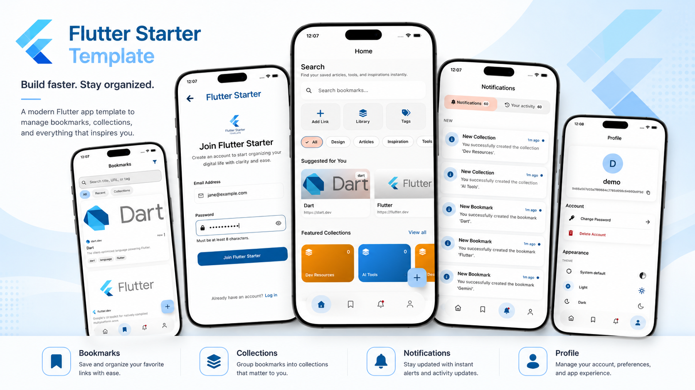
</p>

<p align="center"><sub>JWT auth · Material 3 · offline‑first bookmarks & activity feed</sub></p>


<br>

---

<br>

## 🧬 Architecture

```
.
├── lib/                              # Root Flutter app package (composition root)
│   ├── main.dart                     # Entry: DI → Firebase → runApp
│   ├── app/
│   │   ├── app.dart                  # MaterialApp.router + providers + SessionScope
│   │   ├── router.dart               # TypedGoRoute + auth redirect
│   │   ├── features.dart             # Optional-feature registry (sync controllers)
│   │   ├── di/                       # App-level get_it + injectable wiring
│   │   └── widgets/                  # App-level shell widgets
│   ├── core/
│   │   ├── data/database/            # ObjectBox app-store bootstrap (@preResolve)
│   │   ├── data/sync/                # App-level sync cursor store
│   │   ├── di/                       # App-wide service module (Uuid, …)
│   │   ├── extensions/               # App-specific convenience extensions
│   │   └── platform/firebase/        # App bootstrap for Firebase services
│   └── gen/                          # flutter_gen asset references
├── packages/                         # Dart Pub Workspace members
│   ├── architecture/                 # Failure, Result, UseCase primitives
│   ├── network/                      # Dio, Retrofit, retry/performance interceptors
│   ├── storage/                      # SharedPreferences and secure storage helpers
│   ├── database/                     # Centralized ObjectBox entities, bindings, Store wrapper
│   ├── config/                       # EnvConfig + Remote Config wrapper
│   ├── analytics/                    # Analytics service + route observer
│   ├── app_platform/                 # Camera, picker, permissions, notifications, share
│   ├── sync_connectivity_plus/       # connectivity_plus adapter for the sync engine
│   ├── theme/                        # ThemeBloc and persisted theme state
│   ├── app_ui/                       # Design system, theme, layout, reusable widgets
│   ├── shared_ui/                    # Cross-feature presentation contracts (Session/SessionScope) + shared widgets
│   ├── shared_contracts/             # Cross-feature domain contracts & reader interfaces
│   ├── localization/                 # ARB sources + gen-l10n AppLocalizations + context.l10n
│   ├── test_utils/                   # Shared mocks, images, and mocktail export
│   └── features/                     # Self-contained feature packages (data/domain/presentation)
│       ├── auth/                     # Sign-in, sign-out, session restore
│       ├── splash/                   # Session restoration gate (presentation only)
│       ├── home/                     # Home dashboard (presentation only)
│       ├── profile/                  # User info + account actions
│       ├── notifications/            # Notification & activity feed
│       ├── bookmarks/                # Bookmarks — offline-first CRUD
│       └── collections/             # Collections — offline-first CRUD
├── published/                        # Independently-published packages — own repos, vendored as git submodules
│   ├── rev_sync/                     # Offline-first sync engine (pub.dev; consumed as a path dep)
│   └── cli/                          # `fst` project scaffolder (pub.dev: flutter_starter_template_cli)
├── test/                             # Root app + feature tests
└── integration_test/                 # Device/emulator integration tests
```

The repository uses Dart Pub Workspaces. The root package (`lib/`) is the
assembled Flutter app — a thin composition root: routing, DI composition,
optional-feature wiring, and Firebase bootstrap. It owns no feature code.
Every feature lives as a self-contained package under `packages/features/`, and
reusable infrastructure lives in `packages/`, both consumed through package
entry points such as `package:network/network.dart` and
`package:feature_home/feature_home.dart`.

Workspace packages own their third-party implementation details. For example,
the root app depends on `network`, not directly on `dio` or `retrofit`;
`network` exports those APIs when the app needs the types. The same pattern
keeps platform, storage, analytics, theme, and UI dependencies versioned in one
place and avoids root-package dependency conflicts.

Every feature is a `feature_<name>` package under `packages/features/` with its
own `data/domain/presentation` layers and a micro-package DI module
(`Feature<Name>PackageModule`) the app wires at composition time. Data-less
features such as `home` and `splash` ship only a presentation layer. Genuinely
cross-feature contracts live in `shared_contracts` (domain projections and
reader interfaces) and `shared_ui` (the app-wide `Session`/`SessionScope` and
shared widgets), promoted only on the rule of three. A feature may not import
another feature except through a documented single-consumer **capability**
(e.g. `bookmarks` embeds two `collections` widgets, `profile` surfaces `auth`'s
delete-account flow); both rules are enforced by the architecture guardrail
tests under `test/architecture/`. ObjectBox entities and the generated bindings
are centralized in the `database` package, and localization (ARB sources +
gen-l10n) lives in `localization`, shared by the app shell and every feature
package.

All shared UI lives in `packages/app_ui` and is consumed through
`package:app_ui/app_ui.dart`; add new generic widgets there. Package-owned tests
live beside their package in `packages/<name>/test`, while root app tests stay
under `test/`.

The workspace dependency graph is shown as three focused views — a layered
overview, the infrastructure internals, and the feature packages — rather than
one dense diagram. In every view, arrows point from a package **to what it
depends on**.

**1. Layered overview** — the mental model. Dependencies only ever point
downward: `app → features → shared / infra → architecture`.

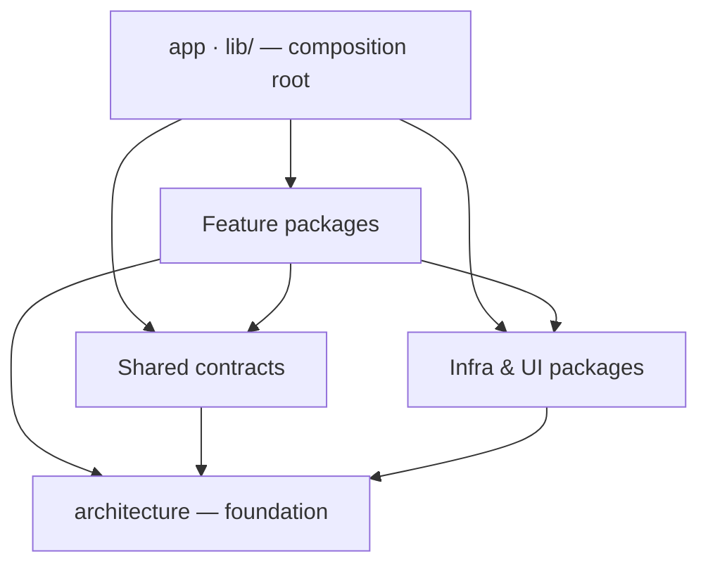

**2. Infrastructure & shared contracts** — the inter-package edges within the
lower layers. The leaf packages `config`, `storage`, `app_ui`, and
`localization` have no workspace dependencies (only third-party libs), so they
don't appear here.

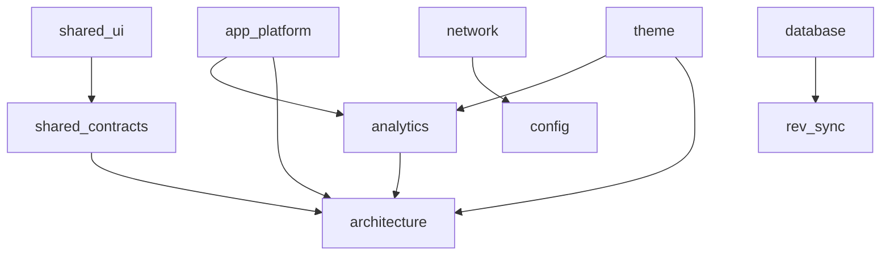

**3. Feature packages** — every feature is a package under `packages/features/`.
The only feature→feature edges are the two documented capabilities: `bookmarks`
reuses two `collections` widgets, and `profile` surfaces `auth`'s delete-account
flow. Infra edges are summarized per feature.

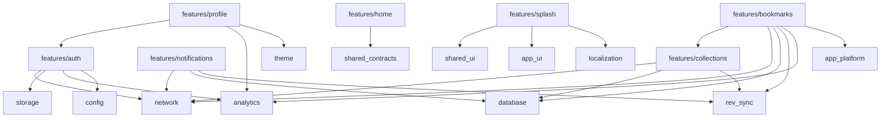

**External dependency encapsulation** — each infrastructure package owns its
third-party libraries so the app (and other packages) depend on the workspace
package, never the raw dependency.

Each box is a workspace package; the libraries inside it are the third-party
dependencies it encapsulates.

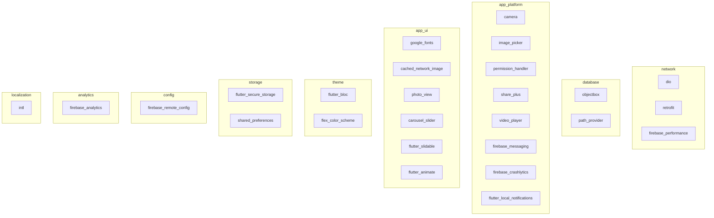

### 📁 Feature Slice (Clean Architecture)

Each feature package keeps its layers under `lib/src/`, with a barrel
(`lib/feature_<name>.dart`) exporting only the public surface (DI module, domain,
screens, capability widgets). Data-less features (`home`, `splash`) ship only
`presentation/`.

```
packages/features/<name>/
├── lib/
│   ├── feature_<name>.dart      Public barrel (DI module, domain, screens)
│   └── src/
│       ├── data/
│       │   ├── datasources/     Remote (Retrofit) + Local (ObjectBox / secure storage)
│       │   ├── models/          Freezed DTOs with toDomain() mappers
│       │   └── repositories/    Concrete implementations
│       ├── domain/
│       │   ├── entities/        Pure Dart classes — zero framework deps
│       │   ├── repositories/    Abstract interfaces
│       │   └── usecases/        Single‑purpose, injectable
│       ├── presentation/
│       │   ├── bloc/            Bloc + freezed state
│       │   └── screens/         Stateless/Stateful widgets
│       ├── di.dart              @InjectableInit.microPackage() anchor
│       └── locator.dart         Shared GetIt instance
└── pubspec.yaml                 name: feature_<name>, resolution: workspace
```

<br>

### 🪄 Scaffolding a New Feature

Rather than hand-create the package above, the project's `fst` CLI scaffolds and
wires a presentation-only feature in one command. Run it from the **repo root**:

```bash
dart pub global activate flutter_starter_template_cli   # one-time — provides `fst`
fst add-feature settings                                # or run bare to be prompted
```

This generates `packages/features/settings/` — a presentation-only slice with a
screen routed at `/settings` — and wires it into every place the app needs to
know about it:

| Wired into | File |
|---|---|
| Workspace member + dependency | `pubspec.yaml` |
| Injectable DI graph | `lib/app/di/injection.dart` |
| `enabledFeatures` registry | `lib/app/features.dart` |

It then runs `pub get` + code generation so the tree compiles immediately. Pass
`--no-codegen` to skip that step and regenerate yourself later.

By default the slice is presentation-only. Pass `--source` to scaffold a data +
domain layer too: `--source local` (an in-feature in-memory store), `--source
api` (a Retrofit client over the shared `Dio`), or `--source sync` (the `api`
layer plus guided offline-first `rev_sync` stubs and a `SYNC_TODO.md`).

The wiring edits land at the `# fst:` / `// fst:` markers in those files (so the
generator never has to parse Dart) — leave the markers in place. The `fst` CLI
source lives in [`published/cli/`](published/cli); it's the same tool as the `fst create`
project scaffolder.

<br>

---

<br>

## 🚀 Quick Start

### 📋 Prerequisites

| Tool    | Version | Notes |
|---------|---------|-------|
| Flutter | ≥ 3.44  | Managed via [FVM](https://fvm.app/) — see `.fvmrc` |
| Go      | ≥ 1.25  | Backend server |
| Node.js | ≥ 18    | Optional — only for the `firebase` MCP server (`npx`) |

### ⚡ Install & Generate

> 🧩 **Starting a new project?** Click **Use this template** on GitHub to spin
> up your own repo, then clone it. To explore the template itself, clone
> directly.

```bash
# --recurse-submodules pulls the companion Go backend (a git submodule)
git clone --recurse-submodules https://github.com/kido-luci/flutter-starter-template.git
cd flutter-starter-template

# One-shot bootstrap: submodules, FVM SDK, disable SPM (macOS), pub get,
# code generation, backend deps, and the pre-push hook. Idempotent.
./tool/setup.sh
```

> 💡 **Already cloned without submodules?** `tool/setup.sh` runs
> `git submodule update --init --recursive` for you. Re-run the script anytime
> your tree needs a refresh; pass `--help` to see flags (`--no-codegen`,
> `--no-hooks`, `--no-backend`).

<details>
<summary><b>⚙️ Prefer to run the steps manually?</b></summary>
<br>

`tool/setup.sh` simply chains these:

```bash
fvm flutter pub get
fvm dart run build_runner build --delete-conflicting-outputs
fvm dart fix --apply --code=directives_ordering .      # see below
fvm flutter config --no-enable-swift-package-manager   # macOS only — see below
git config core.hooksPath .githooks                    # enable the pre-push gate
```

The `dart fix` step matters in a scaffolded project, not in this repo:
`fst create` renames the app package, which moves its own imports in the
alphabetical order `directives_ordering` expects. Re-sorting with the
analyzer's own fix is exact, and a no-op here.

</details>

### 🍎 iOS one-time setup

iOS builds must use CocoaPods, **not** Swift Package Manager — Firebase needs an
iOS 15.0 deployment target, but Flutter 3.44.0 hardcodes the SPM-generated
package to 13.0, and two plugins (`permission_handler_apple`,
`objectbox_flutter_libs`) don't support SPM yet. This setting lives in a
machine-global Flutter config (`~/.config/flutter/settings`), so **every new
machine and CI runner must run it once** before the first iOS build.
`tool/setup.sh` already does this on macOS; to run it by hand:

```bash
fvm flutter config --no-enable-swift-package-manager
```

### 🖥 Start Backend

The backend lives in the [`simple_backend_server`](simple_backend_server) git
submodule. If it's empty, run `git submodule update --init --recursive` first.

```bash
cd simple_backend_server
go run .                    # → http://localhost:8080
```

| Method   | Endpoint                      | Description               |
|----------|-------------------------------|---------------------------|
| `GET`    | `/health`                     | Health check              |
| `POST`   | `/api/auth/register`          | Register a new account    |
| `POST`   | `/api/auth/sign-in`           | Sign in                   |
| `POST`   | `/api/auth/refresh`           | Refresh access token      |
| `POST`   | `/api/auth/sign-out`          | Revoke refresh token      |
| `GET`    | `/api/auth/me`                | Current user              |
| `POST`   | `/api/auth/change-password`   | Change password           |
| `POST`   | `/api/upload`                 | Upload an attachment      |
| `GET`    | `/api/bookmarks`              | List bookmarks (`?since=<rev>` for delta sync) |
| `POST`   | `/api/bookmarks`              | Create bookmark           |
| `GET`    | `/api/bookmarks/:id`          | Get bookmark              |
| `PUT`    | `/api/bookmarks/:id`          | Update bookmark (`X-Expected-Rev` → `409`) |
| `DELETE` | `/api/bookmarks/:id`          | Delete bookmark (soft‑delete tombstone) |
| `GET`    | `/api/collections`            | List collections (`?since=<rev>` for delta sync) |
| `POST`   | `/api/collections`            | Create collection         |
| `GET`    | `/api/collections/:id`        | Get collection            |
| `PUT`    | `/api/collections/:id`        | Update collection (`X-Expected-Rev` → `409`) |
| `DELETE` | `/api/collections/:id`        | Delete collection (soft‑delete tombstone) |
| `GET`    | `/api/notifications`          | List notifications        |
| `GET`    | `/api/activity`               | List activity feed        |

> 💡 **Tip** — Any username + password works during development.

> 🔄 **Sync protocol** — Bookmarks and collections carry a per‑owner `rev`
> (monotonic revision) and `deleted_at` tombstones. Clients pull deltas with
> `?since=<rev>` and send `X-Expected-Rev` on writes for optimistic‑concurrency
> conflict detection (`409`). See [Offline‑First Sync](#-offlinefirst-sync).

### 📱 Launch App

```bash
fvm flutter run
```

<br>

## 🧩 Optional Pillars / Choose Your Stack

The `fst create` command scaffolds the full template by default — offline-first
sync, JWT auth, Firebase, and all three server-backed demo features. Pass flags
at create time to strip any pillar you don't need; the result compiles cleanly
with no leftover stubs.

| Project shape | Command |
|---|---|
| Full offline-first app (default) | `fst create` |
| Without Firebase | `fst create --no-firebase` |
| Without auth (user-less app) | `fst create --no-auth` |
| Fully local-only (no backend, no auth) | `fst create --no-backend` |
| Minimal (local-only + no Firebase) | `fst create --minimal` |

### Flags

**`--no-firebase`** — Scaffolds without Firebase. `kFirebaseEnabled` is set to
`false`, analytics and crash-reporting bindings become no-ops, the Firebase
Android Gradle plugins are removed, and the native credential files are deleted.
The app builds and runs with no Firebase project.

**`--no-auth`** — Removes the auth pillar. Deletes
`packages/features/auth`, strips auth-specific UI from `profile` (leaving a
Settings screen with theme toggle and about only — the user header,
change-password, delete-account, and sign-out actions are gone), and removes
auth wiring from the router and DI graph. The splash screen waits its minimum
display time then proceeds directly.

**`--no-backend`** — Scaffolds a fully local-only app. This flag is a
composite: it implies `--no-auth` (no server means no JWT), removes the three
server-backed demo features (`bookmarks`, `collections`, `notifications`), and
strips the `network` and `sync_connectivity_plus` packages along with the sync
cursor store. The `rev_sync` engine itself **stays** — `database` entities use
its types — but no sync runs. What remains: `home`, `profile` (Settings),
`splash`, and on-device ObjectBox storage.

**`--minimal`** — `--no-backend` + `--no-firebase`. The leanest possible
scaffold: local-only, no Firebase, no accounts.

**`--exclude-feature <name>`** — Drop individual server-backed demo features
(`bookmarks`, `collections`, `notifications`) without removing the whole backend
pillar. Repeatable. Excluding `collections` also excludes `bookmarks` (which
depends on it).

### Composition rules

- `--no-backend` implies `--no-auth`.
- `--minimal` = `--no-backend --no-firebase`.

### Branding & auth provider

- **`--scheme <name>`** — the in-app theme (a FlexColorScheme name, e.g.
  `deepPurple`, `indigo`).
- **`--seed-color <hex>`** — the brand color for the launcher icon + web
  (`adaptive_icon_background` and the web theme colors).
- **`--font <name>`** — the app font (a `google_fonts` method prefix, e.g.
  `roboto`, `openSans`).
- **`--auth-provider <jwt|firebase>`** — the auth backend. `jwt` (default) keeps
  the REST/JWT data layer; `firebase` swaps it for a Firebase Auth
  implementation (requires the Firebase, auth, and backend pillars).

<br>

---

<br>

## 🧪 Testing & Code Quality

This template includes a robust set of automated tests and static analysis configuration to ensure code quality.

### 🏃 Running Tests

Root app tests mirror the `lib/` feature structure. Package-owned tests live
beside the package they cover under `packages/<name>/test`.

```bash
# Run root app unit and widget tests
fvm flutter test --exclude-tags golden

# Run a specific test file
fvm flutter test test/widget_test.dart

# Run tests by name match
fvm flutter test --name "signs in"

# Run a package's own tests
(cd packages/network && fvm flutter test)
```

Shared mocks and test fixtures live in `packages/test_utils` and are exported
through `package:test_utils/test_utils.dart`; root-only fixtures remain in
`test/test_utils/`.

CI runs root tests with coverage, then runs each package test suite with
coverage and merges the LCOV reports before enforcing the workspace coverage
threshold. Golden tests are excluded in CI because baselines are generated on
macOS while CI runs on Ubuntu.

Refer to the [test/README.md](test/README.md) file for detailed testing
guidelines and patterns.

### 🧭 End-to-End Testing

Unlike the unit/widget/bloc suites above — which mock every boundary —
`integration_test/` runs a single real-backend journey: it boots the actual
assembled `App` (real DI, real Firebase, **no mocks**) against the local
`simple_backend_server` and walks one self-seeded user through every feature —
register, bookmarks, collections, notifications, sign-out — proving the real
Dio client → repositories → use cases → backend → SQLite all wire together.

```bash
tool/run_e2e.sh                 # one shot: reset + start backend, run, tear down
tool/run_e2e.sh <device-id>     # target a specific `flutter devices` id
```

It needs a booted **iOS Simulator** (not macOS — only `ios/` ships a
`GoogleService-Info.plist`) and isn't run in CI, since it requires a live
backend and emits real Firebase telemetry. Run it locally before cutting a
release. See [integration_test/README.md](integration_test/README.md) for
details, gotchas, and how to run it manually against an already-running
backend.

### 🔍 Static Analysis & Linting

Verify lint rules, formatting, and type safety before committing:

```bash
# Analyze code for warnings and errors
fvm flutter analyze

# Automatically apply quick fixes
fvm dart fix --apply

# Format all Dart files
fvm dart format .
```

<br>

## 🔄 Git Workflow & PRs

The `main` branch is protected — all changes land through Pull Requests, with
**CodeRabbit** AI review and **CodeQL** security scanning on every PR.

The full contributor workflow — branch naming, the local verification gate, the
pre-push hook, opening a PR, and the AI review / security tooling — lives in
[**`CONTRIBUTING.md`**](CONTRIBUTING.md).

```bash
# The local gate CI enforces — run before pushing
fvm dart format .
fvm flutter analyze
fvm flutter test --exclude-tags golden
```

<br>

---

<br>

## 🔥 Firebase

Crashlytics + Analytics + Messaging — pre‑configured and ready to connect.

```bash
fvm dart pub global activate flutterfire_cli
flutterfire configure                          # → lib/firebase_options.dart
```

Drop these into your project:
- `android/app/google-services.json`
- `ios/Runner/GoogleService-Info.plist`

The Firebase **platform** (core, remote config, messaging) initializes in
`lib/main.dart` behind the `kFirebaseEnabled` flag in `lib/app/firebase.dart`,
with crash reporting installed through the `CrashReporter` port.

### Optional & swappable

Firebase is opt-out. `fst create --no-firebase` scaffolds a project that builds
and runs with **no Firebase project at all**: it flips `kFirebaseEnabled` to
`false`, swaps the analytics and crash bindings to no-ops, removes the Firebase
Android Gradle plugins, and deletes the native credential files. Re-enable later
by flipping the flag, restoring the bindings, and running `flutterfire configure`.

Analytics and crash reporting are independent **ports** (`AnalyticsService`,
`CrashReporter`), wired in the `analytics` and `app_platform` packages. Each has
a Firebase adapter and a no-op, selected at a single `// fst:analytics-impl` /
`// fst:crash-impl` binding — so you can keep one on Firebase and the other off,
or plug in your own backend, by editing just that line.

<br>

---

<br>

## 🍦 Flavors & Environment

Three build flavors driven by `--dart-define` with typed runtime config:

| Flavor    | Android App ID                                    | iOS Bundle ID                                |
|-----------|---------------------------------------------------|----------------------------------------------|
| `dev`     | `com.lucistudio.flutter_starter_template.dev`     | `com.luci-studio.flutterStarterTemplate.dev` |
| `staging` | `com.lucistudio.flutter_starter_template.staging` | `com.luci-studio.flutterStarterTemplate.staging` |
| `prod`    | `com.lucistudio.flutter_starter_template`         | `com.luci-studio.flutterStarterTemplate`     |

```bash
fvm flutter run --flavor dev     --dart-define-from-file=env/dev.json
fvm flutter run --flavor staging --dart-define-from-file=env/staging.json
fvm flutter run --flavor prod    --dart-define-from-file=env/prod.json
```

`EnvConfig` (`packages/config/lib/config.dart`) surfaces API base URL,
Firebase project IDs, and flavor name from `String.fromEnvironment` at startup.

<br>

---

<br>

## 🚀 Release (Fastlane)

iOS → TestFlight and Android → Google Play are automated with [Fastlane](https://fastlane.tools),
one flavor‑aware `beta` lane per platform. Every credential is read from a
git‑ignored `.env` (plus `key.properties` on Android), so nothing secret is
committed — fill those in and go.

```bash
cd ios     && bundle exec fastlane beta flavor:prod   # → TestFlight
cd android && bundle exec fastlane beta flavor:prod   # → Google Play
```

- **Signing** — iOS uses [`match`](https://docs.fastlane.tools/actions/match/)
  (cert + profiles in a private repo); Android uses an upload keystore wired via
  `android/key.properties` (falls back to debug signing when absent, so the
  template still builds out of the box).
- **Build numbers** auto‑increment (lane arg → `BUILD_NUMBER` → git commit
  count) so repeated uploads are never rejected.
- **CI** — [`.github/workflows/release.yml`](.github/workflows/release.yml) runs
  both lanes on **manual dispatch** (Actions → Release; macOS for iOS, Linux for
  Android), restoring the git‑ignored Firebase configs and signing assets from
  repository secrets. To fire releases from a `v*` tag instead, add a
  `push: tags: ['v*']` trigger to that workflow.

Setup steps and the full list of required secrets live in
[`ios/fastlane/README.md`](ios/fastlane/README.md) and
[`android/fastlane/README.md`](android/fastlane/README.md).

<br>

---

<br>

## 📶 Offline‑First Sync

Writes commit to the local **ObjectBox** store first and the UI updates
immediately — the network is reconciled in the background, so the app stays
fully usable offline. The sync machinery is a single reusable engine in the
**`rev_sync` package** (`published/rev_sync`); `bookmarks` and `collections` drive it
through a thin per‑feature adapter, and `notifications` is a read‑state variant
that reuses only the scheduler.

The full model — the shared engine, local‑first writes, the scheduler, and
push/pull with revision‑based delta sync, tombstones, and conflict detection —
is documented in
[`packages/features/README.md`](packages/features/README.md#-offlinefirst-sync).

<br>

---

<br>

## 🔗 Deep Linking

Universal Links (iOS) + App Links (Android) with a `DeepLinkState` holder that replays deferred links post‑auth.

<details>
<summary><b>📁 Config files to update</b></summary>
<br>

| Platform  | File                                    |
|-----------|-----------------------------------------|
| Android   | `android/app/src/main/AndroidManifest.xml` |
| iOS       | `ios/Runner/Info.plist`                 |
| iOS       | `ios/Runner/Runner*.entitlements`       |

Replace `yourdomain.com` with your actual domain, then host these on your server:

**`/.well-known/apple-app-site-association`**
```json
{
  "applinks": {
    "apps": [],
    "details": [{
      "appIDs": ["TEAM_ID.com.luci-studio.flutterStarterTemplate"],
      "paths": ["*"]
    }]
  }
}
```

**`/.well-known/assetlinks.json`**
```json
[{
  "relation": ["delegate_permission/common.handle_all_urls"],
  "target": {
    "namespace": "android_app",
    "package_name": "com.lucistudio.flutter_starter_template",
    "sha256_cert_fingerprints": ["YOUR_SHA256"]
  }
}]
```

</details>

<br>

---

<br>

## 🧩 UI Widgets

Shared app components live in `packages/app_ui` and are exported through
`package:app_ui/app_ui.dart`.

| Widget              | Purpose                                                          |
|---------------------|------------------------------------------------------------------|
| `AppAdaptiveScaffold` | Responsive navigation shell with bottom bar / rail behavior    |
| `AppAnimatedText`   | Typewriter + fade text animations                                |
| `AppButton`         | Loading state, expand‑to‑fill, leading icon                      |
| `AppCarousel`       | Auto‑play slider with dot indicators                             |
| `AppEmptyView`      | Empty‑state placeholder — icon + message                         |
| `AppErrorView`      | Error state — icon + message + retry                             |
| `AppLinkPreview`    | Rich card — image, title, description                            |
| `AppListDetailPane` | Responsive master/detail layout primitive                        |
| `AppLoading`        | Centered spinner                                                 |
| `AppNetworkImage`   | Cached network image with loading placeholder and error widgets  |
| `AppPhotoView`      | Interactive image viewer with zoom, rotation, and fullscreen gallery |
| `AppScaffold`       | Themed shell — app bar, connectivity banner                      |
| `AppSkeleton`       | Lightweight loading skeleton                                     |
| `AppSlidable`       | Swipe‑to‑reveal actions wrapper for list items                    |
| `AppTextField`      | Label, prefix icon, validation, autofill hints                   |

Feature-specific widgets stay inside their feature slice. For example, bookmark
video playback widgets live under
`packages/features/bookmarks/lib/src/presentation/widgets/` because they are tied
to bookmark attachment behavior.

<br>

---

<br>

## 🧰 Tech Stack

| Layer              | Packages                                                                                           |
|--------------------|----------------------------------------------------------------------------------------------------|
| **State**          | `flutter_bloc` (Bloc) · `bloc_concurrency`                                                         |
| **Routing**        | `go_router` · `go_router_builder`                                                                  |
| **DI**             | `get_it` · `injectable`                                                                            |
| **Networking**     | `network` (`Dio` · `Retrofit`)                                                                |
| **Code Gen**       | `build_runner` · `freezed` · `json_serializable` · `retrofit_generator` · `injectable_generator` · `go_router_builder` · `flutter_gen_runner` · `objectbox_generator` |
| **Local DB**       | `ObjectBox` (`objectbox` · `objectbox_flutter_libs`)                                               |
| **Offline Sync**   | `rev_sync` (revision delta engine, scheduler, conflict detection) · `connectivity_plus`               |
| **Secure Storage** | `storage` (`flutter_secure_storage` · `shared_preferences`)                                    |
| **Auth**           | JWT — access + refresh tokens                                                                      |
| **Theming**        | `theme` · Material 3 · `flex_color_scheme` · `google_fonts` (Inter)                           |
| **i18n**           | `flutter_localizations` · `intl`                                                                   |
| **Icons**          | `cupertino_icons`                                                                                  |
| **Assets**         | `flutter_svg` · `flutter_gen_runner`                                                               |
| **Image / Media**  | `app_ui` · `app_platform` (`photo_view` · `image_picker` · `camera` · `video_player` · `cached_network_image` · `vector_graphics`) |
| **Carousel**       | `carousel_slider`                                                                                  |
| **List Slidables** | `flutter_slidable`                                                                                 |
| **Permissions**    | `app_platform` (`permission_handler`)                                                             |
| **Notifications**  | `app_platform` (`flutter_local_notifications` · `firebase_messaging`)                             |
| **Firebase**       | `firebase_core` · `analytics` · `app_platform`                                                |
| **Animations**     | `flutter_animate` · `animated_text_kit`                                                            |
| **Haptics**        | `HapticFeedback` (Flutter Services)                                                                |
| **Connectivity**   | `connectivity_plus`                                                                                |
| **Storage**        | `path_provider` · `shared_preferences`                                                             |
| **Device Info**    | `package_info_plus`                                                                                |
| **URL**            | `url_launcher`                                                                                     |
| **Share**          | `app_platform` (`share_plus`)                                                                     |
| **Link Preview**   | `flutter_link_previewer`                                                                           |
| **UUID**           | `uuid`                                                                                             |
| **Splash**         | Custom session-restore bootstrapper (no package)                                                   |
| **Testing & Lints**| `test_utils` (`mocktail`) · `bloc_test` · `very_good_analysis` · `build_verify`                    |
| **Backend**        | Go — `chi/v5` · `golang-jwt/v5` · `cors`                                                          |

<br>

---

<br>

## 📱 Screen Gallery

<p align="center">
  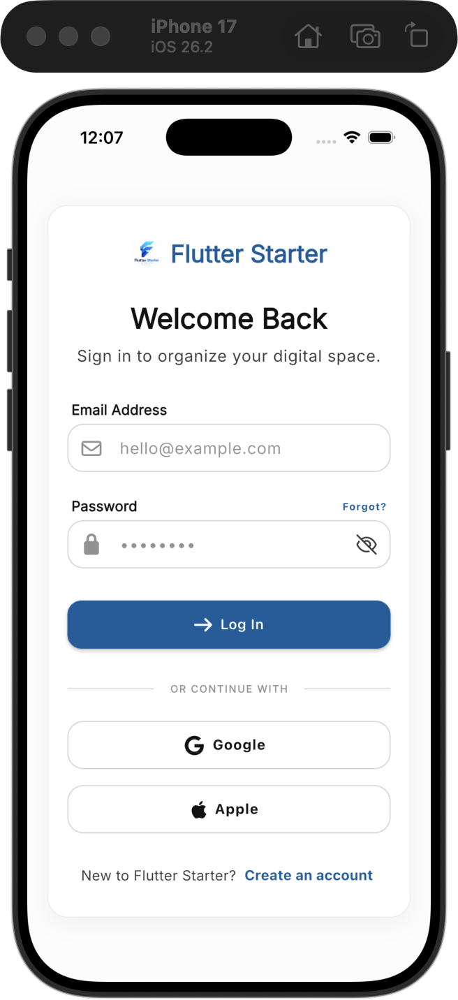
  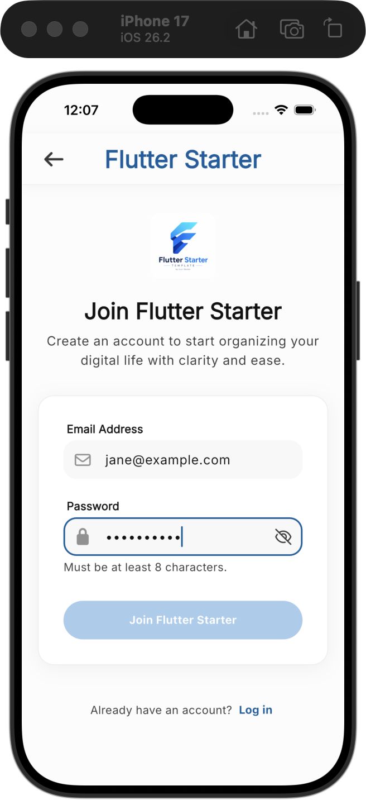
  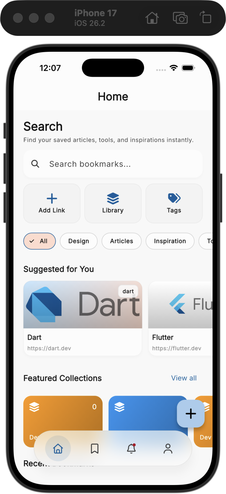
  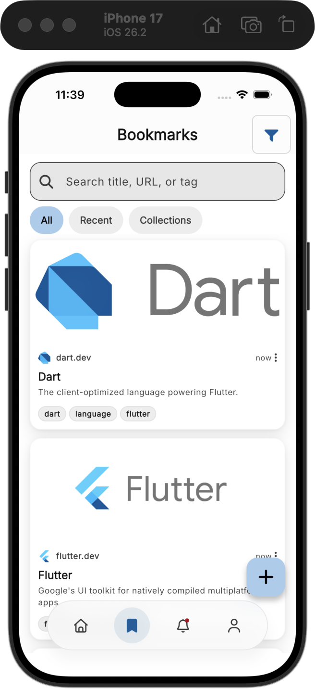
</p>
<p align="center">
  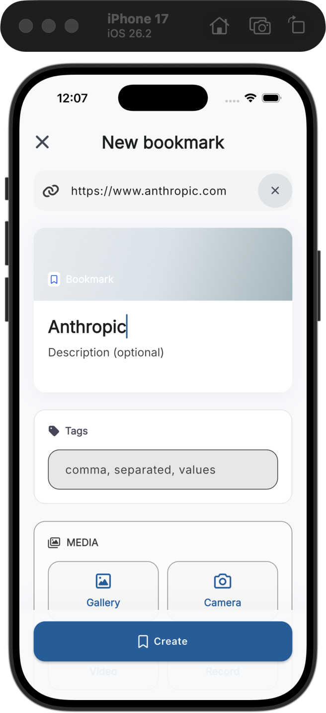
  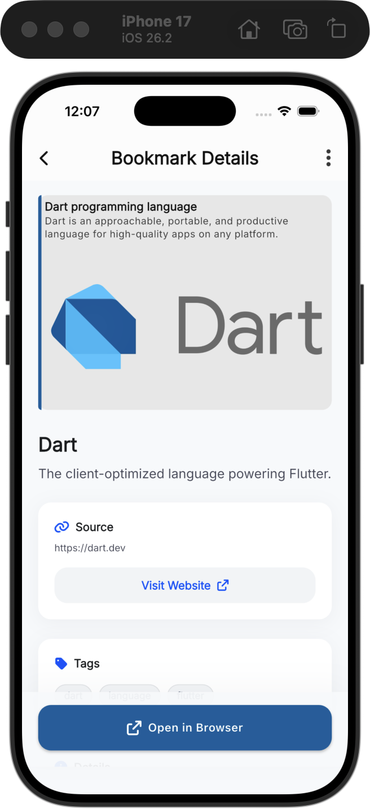
  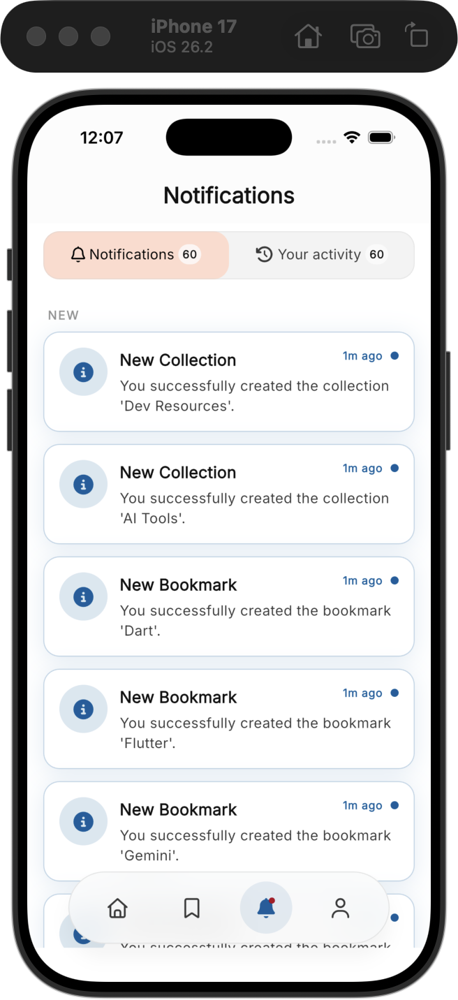
  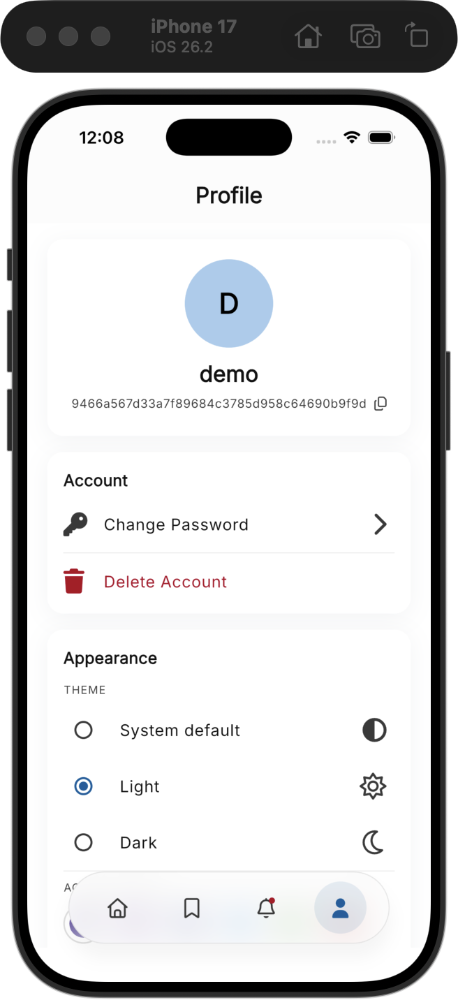
</p>

<br>

---

<br>

## 🤖 AI‑Native Workflow

This project is built for AI‑assisted development with **Claude Code**.

### 🧪 MCP Servers

Project‑scoped MCP servers in `.mcp.json` give agents direct access to:

| Server      | Command                                        | Purpose                                      |
|-------------|------------------------------------------------|----------------------------------------------|
| `dart`      | `fvm dart mcp-server`                          | Static analysis, formatting, packages, tests |
| `codegraph` | `codegraph serve --mcp --path <project-root>` | Symbol search, callers/callees, code context |
| `firebase`  | `npx -y firebase-tools@latest mcp`             | Crashlytics, project config, deploy, security rules |

> 💡 **Tip** — If the CodeGraph index is missing or out of sync, build/update it by running:
> ```bash
> codegraph init -i
> ```

### 📜 Rules Files

| Tool            | File        |
|-----------------|-------------|
| Claude Code     | `CLAUDE.md` |

### 🛠 Agent Skills

Official playbooks from `flutter/skills`, `dart-lang/skills`, and `firebase/agent-skills` are vendored in `.agents/skills/` and pinned in `skills-lock.json`.

<details>
<summary><b>🦋 Flutter Skills</b> (10)</summary>
<br>

| Skill                                   | Focus                            |
|-----------------------------------------|----------------------------------|
| `flutter-setup-declarative-routing`     | `go_router` + typed routes       |
| `flutter-implement-json-serialization`  | `fromJson` / `toJson`            |
| `flutter-add-widget-test`               | `WidgetTester` component tests   |
| `flutter-add-widget-preview`            | Interactive widget previews      |
| `flutter-add-integration-test`          | `integration_test`               |
| `flutter-apply-architecture-best-practices` | UI / Logic / Data layers     |
| `flutter-build-responsive-layout`       | `LayoutBuilder` · `MediaQuery`   |
| `flutter-fix-layout-issues`             | Overflow · unbounded constraints |
| `flutter-setup-localization`            | `intl` + ARB                     |
| `flutter-use-http-package`              | REST API integration             |

</details>

<details>
<summary><b>🎯 Dart Skills</b> (9)</summary>
<br>

| Skill                                | Focus                                  |
|--------------------------------------|----------------------------------------|
| `dart-add-unit-test`                 | `package:test` unit tests              |
| `dart-run-static-analysis`           | `dart analyze` + `dart fix`            |
| `dart-fix-runtime-errors`            | Stack trace diagnostics                |
| `dart-generate-test-mocks`           | `mockito` + `build_runner`             |
| `dart-collect-coverage`              | LCOV coverage reports                  |
| `dart-build-cli-app`                 | CLI entrypoints · exit codes           |
| `dart-resolve-package-conflicts`     | `pub get` conflict resolution          |
| `dart-migrate-to-checks-package`     | `matcher` → `checks` migration         |
| `dart-use-pattern-matching`          | Switch expressions · pattern matching  |

</details>

<details>
<summary><b>🔥 Firebase Skills</b> (11)</summary>
<br>

| Skill                              | Focus                                  |
|------------------------------------|----------------------------------------|
| `firebase-basics`                  | Firebase project fundamentals          |
| `firebase-auth-basics`             | Authentication setup                   |
| `firebase-crashlytics`             | Crash reporting integration            |
| `firebase-firestore`               | Cloud Firestore data modeling          |
| `firebase-data-connect`            | Data Connect (Postgres) integration    |
| `firebase-remote-config-basics`    | Remote Config flags                     |
| `firebase-ai-logic-basics`         | Firebase AI Logic (Gemini)             |
| `firebase-hosting-basics`          | Static web hosting                     |
| `firebase-app-hosting-basics`      | App Hosting for dynamic apps           |
| `firebase-security-rules-auditor`  | Security rules review                  |
| `xcode-project-setup`              | iOS/Xcode project configuration        |

</details>

<br>

---

<br>

## 🔄 Code Generation

```bash
fvm dart run build_runner build --delete-conflicting-outputs   # one-shot
fvm dart run build_runner watch --delete-conflicting-outputs   # incremental
```

Runs Freezed, Retrofit, Injectable, ObjectBox, `go_router_builder`, `flutter_gen`, and `json_serializable`.

### 📦 Generated files are git-ignored (regenerate after clone)

This repo **does not track** most generated output (`*.g.dart`,
`*.freezed.dart`, `*.config.dart`, `*.gen.dart`) — it is `.gitignore`-d and
regenerated on demand. So **after cloning (or after any `pub get`), run
`build_runner` once** before the project will compile:

```bash
fvm dart run build_runner build --delete-conflicting-outputs
```

Until you do, your IDE/analyzer will show errors for the missing generated
sources. This keeps PR diffs free of generated noise and avoids
generated-file merge conflicts.

**The database packages are the deliberate exceptions.** ObjectBox's
`lib/objectbox.g.dart` **and** `lib/objectbox-model.json` stay
version-controlled (the `.gitignore` negates the binding; the model file
matches no glob). Together they hold the stable entity/property **UIDs** that
keep on-device data intact across schema migrations, so regenerating them from
scratch would risk a destructive schema change. Drift's
`lib/src/app_database.g.dart` and its `drift_schemas/` snapshots are tracked
for a related reason: the snapshots are the only record of what each released
`schemaVersion` looked like, and every migration test replays from them. All
are source-of-truth files.

That difference in UID stability is also why only the Drift package is
regenerated at scaffold time: `fst create` can remove a feature's table, so
the binding has to be rebuilt against what survived. ObjectBox keeps its
entities instead — see [`drift_schemas/README.md`](packages/database_drift/drift_schemas/README.md)
for the schema-change workflow.

How the pieces stay consistent:

- **CI** ([`.github/workflows/ci.yml`](.github/workflows/ci.yml)) runs
  `build_runner` before analyze/test (producing the ignored files), and the
  _"Generate code & verify ObjectBox binding is up to date"_ step fails if the
  tracked database files drift — i.e. someone changed an `@Entity` or a Drift
  table without committing the regenerated binding.
- **Release lanes** ([`.github/workflows/release.yml`](.github/workflows/release.yml))
  run `build_runner` before the Fastlane build, since `flutter build` does not.
- **`.dart_tool/build` is intentionally not cached** in CI/release. Because the
  outputs are git-ignored, a checkout has none; a restored build cache makes
  `build_runner` skip regenerating files it believes already exist (observed
  with `flutter_gen`'s `assets.gen.dart`), producing a broken tree. Each run
  does a correct full build from an empty cache instead.
- **`.gitattributes`** still marks `*.g.dart`/`*.freezed.dart`/etc.
  `linguist-generated=true`, which applies to the tracked ObjectBox binding.

<br>

## 🌐 Localization (i18n)

Translations live in the `localization` package — ARB (Application Resource
Bundle) sources under [packages/localization/lib/l10n/](packages/localization/lib/l10n/),
configured by [packages/localization/l10n.yaml](packages/localization/l10n.yaml).
English and Vietnamese ship out of the box.

### 🛠 Generating Translations

The gen-l10n output is generated alongside the ARB sources in the
`localization` package:

```bash
# Generate localization resources manually
(cd packages/localization && fvm flutter gen-l10n)
```

Import `package:localization/localization.dart` and use
`AppLocalizations.of(context)` (or the `context.l10n` extension) to access
localized strings. The package is shared by the app shell and every feature
package.

<br>

---

<br>

<a id="support"></a>

## ❤️ Support

If this template saves you time, you can support its development:

<a href="https://paypal.me/TrungLapTieu?locale.x=en_US&country.x=VN">
  
</a>

<br><br>

<sub>On desktop? Scan to pay from your phone:</sub>


Every bit is appreciated and helps keep this project maintained. 🙏

<br>

---

<br>

<p align="center">
  <sub>Made with ❤️ by <a href="https://luci-studio.com">Luci Studio</a></sub>
  <br><br>
  <a href="https://github.com/kido-luci/flutter-starter-template/blob/main/LICENSE">
    
  </a>
</p>
